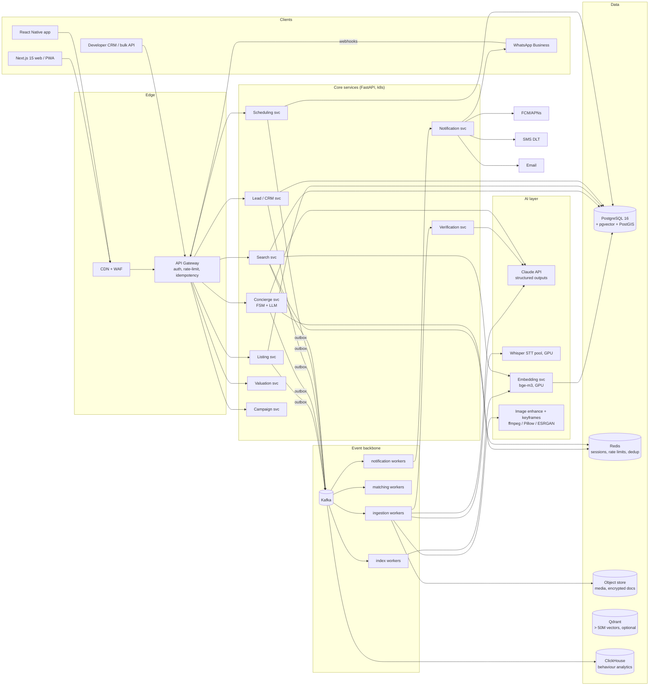
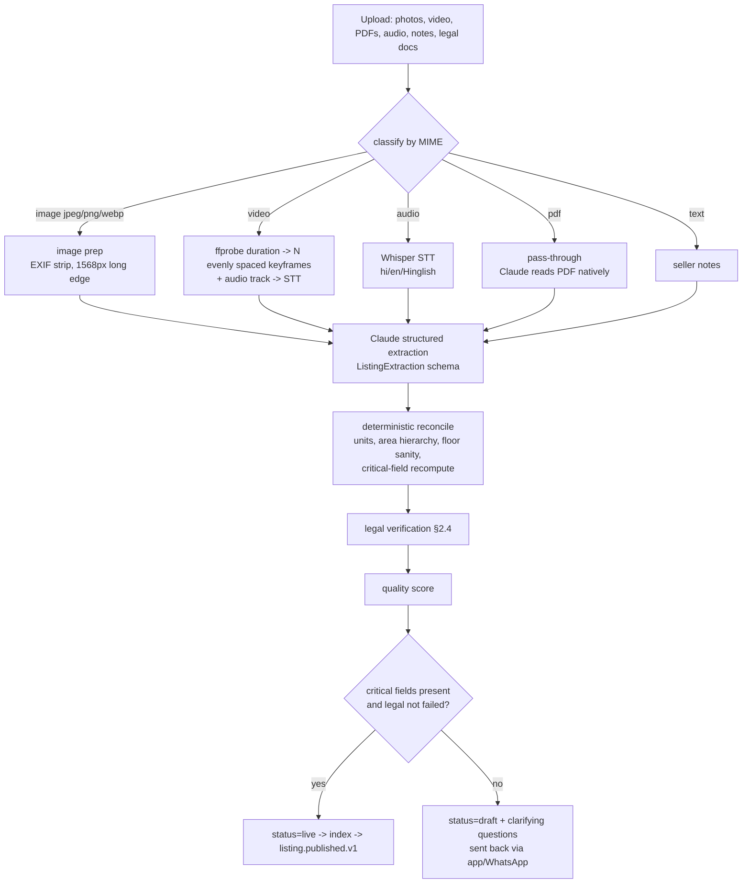
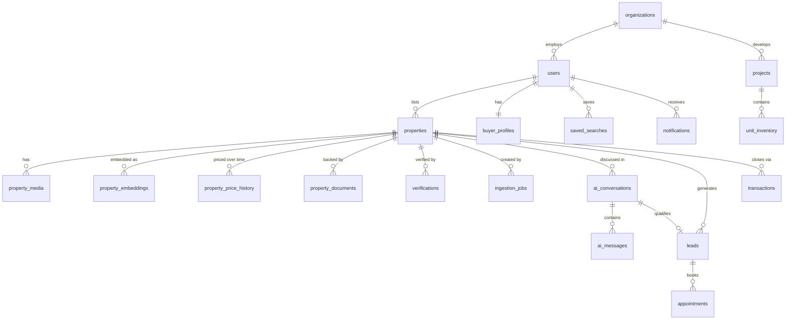
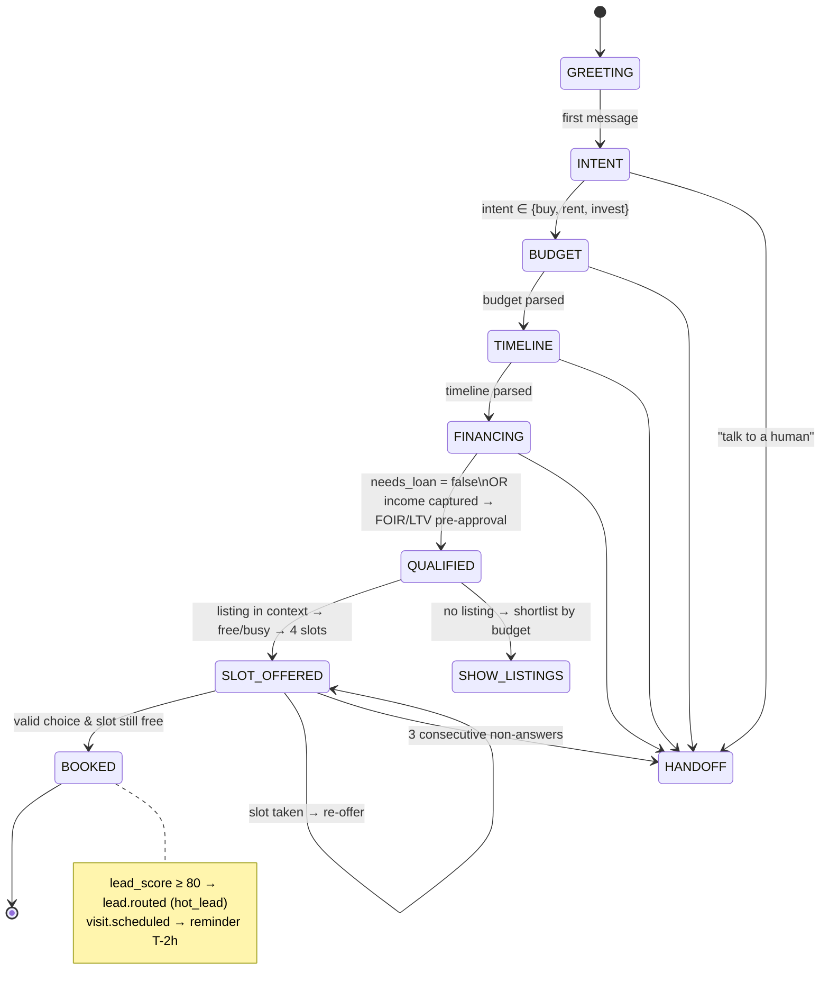

# AIPropertyTool: architecture blueprint

An AI-native, free-to-list real-estate portal for the Indian market. Sellers don't fill in forms, buyers don't use dropdown filters, and the routine work between them (qualifying buyers, booking visits, follow-ups and alerts) is automated.

This document covers Sections 1–4 of the blueprint. Section 5 (API) is in [`API.md`](API.md). Section 6 (code) is in [`backend/`](../backend) and [`frontend/`](../frontend), with an index in the root [`README.md`](../README.md).

Each part is marked as one of two kinds:

- **MVP**: implemented in this repo and covered by tests.
- **Prod**: the production design that the MVP interfaces are built to plug into.

---

## Section 1: System architecture and tech stack

### 1.1 High-level architecture



**Request path vs. event path.** Synchronous APIs only do work that the user is waiting for: parsing a search, returning a chat reply, accepting an upload. Anything that fans out goes through the event path: a new listing triggers matching, which triggers notifications and CRM updates. Every service writes its domain events to an `outbox_events` table in the same transaction as its state change. Debezium relays the outbox to Kafka, so no event is lost and none is published for a rolled-back write.

> **MVP status:** the backend persists to PostgreSQL when `DATABASE_URL` is set (in-memory otherwise). Every published event is written to `outbox_events`, but in a separate statement from the state change, not yet the same transaction. Consumers run in-process rather than as Kafka workers.

### 1.2 Tech stack

| Layer | Choice | Why |
|---|---|---|
| Web | **Next.js 15** (App Router, RSC), TypeScript | SEO-critical listing pages are server-rendered. Chat and uploader are client components. |
| Mobile | React Native + Expo | Shares the API client and types with the web app. |
| API services | **Python 3.12 + FastAPI**, Pydantic v2 | The AI ecosystem is in Python. Pydantic models double as LLM JSON schemas, so one contract serves both. |
| LLM | **Claude** (`claude-opus-5-5`) via the Anthropic SDK, using structured outputs (`output_config.format`) and server-side refusal fallbacks | Native image and PDF input means no separate OCR stage for most documents. Schema-guaranteed JSON. 1M context fits whole brochures. |
| Agent orchestration | Deterministic FSM in code, with the LLM used for language only (concierge). LangGraph is optional for longer multi-tool agent flows such as the agent-CRM copilot. | Qualification and booking must be auditable and impossible to skip. See §4. |
| STT | faster-whisper (large-v3 on GPU in prod) | Handles Hindi, Hinglish and regional accents. Self-hosted for cost at volume. |
| Embeddings | **BAAI/bge-m3** (1024-d, multilingual, dense and sparse) | Handles Hinglish queries. Self-hosted. |
| Primary DB | **PostgreSQL 16 + pgvector (HNSW) + PostGIS + pg_trgm** | Filters, vectors and full-text search in one query with transactional consistency. See [`sql/`](../backend/sql). |
| Vector DB at scale | Qdrant (optional, beyond ~50M vectors or for image-similarity search) | Payload filtering mirrors the SQL filters, and the dual-write is driven from Kafka. |
| Cache / sessions | Redis 7 | Concierge session state, rate limits, notification dedup keys, slot locks. |
| Event bus | **Kafka** (MSK / Confluent) | Ordered per aggregate, replayable, and fans out to many consumers. RabbitMQ is acceptable below about 1k events/s. |
| Real-time UI | WebSockets (FastAPI) / SSE for streaming chat | |
| Messaging | WhatsApp Cloud API, FCM/APNs, SMS (DLT-registered templates), SES | |
| Storage | S3-compatible storage with KMS. Legal documents go to a separate bucket and are served only via short-lived signed URLs. | |
| Analytics | ClickHouse, fed from Kafka | Powers developer intent analytics and model feedback. |
| Infra | Kubernetes (EKS/GKE), Terraform, Argo CD, OpenTelemetry + Grafana | GPU node pool for STT, embeddings and image work. |

### 1.3 Service responsibilities

| Service | Owns | Emits |
|---|---|---|
| Listing | properties, media, price history, ingestion jobs | `listing.published.v1`, `listing.price_changed.v1`, `listing.status_changed.v1` |
| Verification | documents, verifications | `listing.verified.v1`, `listing.verification_failed.v1` |
| Search | query parsing, ranking, saved searches | `search.performed.v1` |
| Matching (worker) | buyer_profiles, reverse search | `match.found.v1` |
| Concierge | ai_conversations, ai_messages | `lead.updated.v1`, `lead.routed.v1`, `visit.scheduled.v1` |
| CRM | leads, follow-up cadences, collateral generation | `lead.followup_due.v1` |
| Scheduling | appointments, calendar sync | `visit.reminder_due.v1`, `visit.completed.v1` |
| Valuation (AVM) | comparables, model features | `valuation.updated.v1` |
| Campaign | developer launches, budgets, creatives | `campaign.lead_captured.v1` |
| Notification | notifications, templates, preferences | `notification.sent.v1`, `notification.delivered.v1` |

### 1.4 Stakeholder workflows

| Stakeholder | What is automated | Where |
|---|---|---|
| **Buyer** | NL search. Proactive matches and price-drop alerts. Instant affordability and indicative loan pre-qualification (FOIR and LTV). AI neighbourhood insights (PostGIS isochrones to tech parks, schools and metro, combined with civic data). Legal summary in plain language. | MVP: search, matching, `/ai/affordability`, legal summary. Prod: neighbourhood. |
| **Seller / owner** | Zero-form listing from photos, video and voice. Automatic photo QA and cover pick. Legal badge. AVM estimate: gradient-boosted model on registry transactions and listing comparables, with an LLM-written rationale. Lead scoring. Agreement-of-sale draft generated from the transaction record, the state template and Claude, with a lawyer-review gate. | MVP: ingestion, verification, lead score. Prod: AVM, agreement. |
| **Agent / broker** | AI CRM: every lead arrives pre-qualified and scored. Automatic follow-up cadences. Their inventory is matched against their own buyer book (the same reverse search, scoped to the agent). One-click collateral: brochure PDF, reel script and WhatsApp catalog card generated from the listing JSON. | Prod (reuses matching and LLM extraction). |
| **Developer / marketer** | Bulk inventory from CAD/DXF and master-plan PDFs: Claude reads the unit schedule sheet and emits `unit_inventory` rows, and DXF layers are parsed for unit polygons. Launch campaign manager: audience = buyer profiles whose intent embedding is close to the project, with budget pacing across Meta, Google and WhatsApp. Creative A/B testing. Buyer-intent analytics per tower, BHK and price band. | Prod. Schema is in `projects` and `unit_inventory`. |

### 1.5 Non-functional targets

| Concern | Target / mechanism |
|---|---|
| Search latency | p95 < 600 ms. The parse step uses `effort: low` and is cached by normalised query in Redis for 24 h. Retrieval is a single SQL round-trip. |
| Ingestion | p95 < 90 s for 20 photos plus a 2-minute video. The upload returns `202` with a job id. The UI subscribes over SSE. (The MVP is synchronous.) |
| Cost control | Static system prompts are prompt-cached. Images are downscaled to a 1568 px long edge. At most 20 images per extraction. Query-parse cache. Batch API for nightly re-extractions. |
| Identity | Phone OTP login, 15-minute JWT access tokens, rotating 30-day refresh tokens with reuse detection, httpOnly `SameSite=Strict` cookies for web. Caller identity comes only from the token. Owners alone can change their listings, drafts are private, notifications are per user, the event log is admin-only, and WhatsApp webhooks are HMAC-verified. (MVP: implemented. Prod adds an SMS provider, KYC for agent/developer roles and per-IP rate limits at the gateway.) |
| Safety | Document-derived text is treated as data, never as instructions. Badges are issued by rule checks only, never by the model (§2.4). Phone numbers are masked until a visit is booked. PII is encrypted at rest. |
| Trust | Every AI field carries `field_confidence` and a `source`. Low-confidence critical fields become clarifying questions instead of being published. |

---

## Section 2: AI pipeline and multimodal processing

### 2.1 Listing ingestion: raw media to structured listing

Implemented in [`backend/app/ingestion/pipeline.py`](../backend/app/ingestion/pipeline.py).



| Step | Logic | Failure handling |
|---|---|---|
| 1. Classify | MIME from header, falling back to extension. HEIC is converted in prod and rejected in the MVP. | Unsupported types become a warning, and the rest continue. |
| 2. Video | Sample `N=6` keyframes at `(i+0.5)/N` of the duration, scaled to 1568 px. Prod uses scene-change detection (`select='gt(scene,0.3)'`) and dedups with a perceptual hash. The audio track is extracted at 16 kHz mono for STT. | No ffmpeg or a corrupt file gives a warning. Narration-only extraction still works. |
| 3. Audio | faster-whisper with VAD. The language is auto-detected and the transcript is tagged with its source file. | If STT is unavailable, the client can send `transcript` (from the Web Speech API). |
| 4. Images | Downscaled for the LLM. Gallery enhancement runs asynchronously and stays off the critical path: auto-exposure, perspective correction, super-resolution, watermark and face blur. | Images over 5 MB without Pillow are skipped with a warning. |
| 5. Extract | A single Claude call: labelled images (`[image i] video keyframe at 12.5s of walk.mp4`), PDFs, then transcripts and notes, with `output_config.format = json_schema(ListingExtraction)`. The schema is generated from Pydantic: refs inlined, every property required, `additionalProperties: false`. | Refusal, truncation or API error falls back to the heuristic parser over the text evidence and adds a warning. |
| 6. Reconcile | (a) Lakh/crore slip: if the model's price differs from the text-parsed price by more than 2×, the text wins. (b) Swap carpet, built-up and super built-up if they are out of order. (c) Flag area per BHK under 150 sq ft. (d) Floor greater than total floors. (e) Recompute critical missing fields: price, area, city, and BHK for residential. | Warnings are surfaced to the seller. |
| 7. Verify | §2.4 | |
| 8. Score and publish | quality = 0.45 × completeness + 0.2 × photo count + 0.15 × photo QA + 0.2 × legal | Draft listings send clarifying questions over the seller's channel. |
| 9. Index | Write the text embedding of `document_text(listing)`, plus derived `preference_tags` (`abundant natural light`, `near tech parks`, `low maintenance`, ...). | |

**Source precedence**, encoded in the prompt: official docs > floor plans > transcript/notes > photos. Photos are never used to infer facing. Facing comes only from a statement or a floor plan with a north arrow.

### 2.2 Vector and hybrid search architecture

Implemented in [`backend/app/search/`](../backend/app/search). The production SQL is in [`sql/002_hybrid_search.sql`](../backend/sql/002_hybrid_search.sql), validated on Postgres 16 with pgvector.

```
NL query
  │  Claude (effort=low) → ParsedQuery{filters, soft_preferences, semantic_query}
  │  (heuristic parser when LLM is unavailable)
  ▼
① Hard filters (SQL WHERE; B-tree/GIN)  — price, BHK, city, locality, facing, txn, maint, amenities, verified
  ▼ candidate set
② Dense recall: bge-m3 vector of (semantic_query + soft prefs), HNSW cosine, top-200
③ Sparse recall: tsvector/BM25 (title, locality, project weighted A; description B), top-200
④ Fusion: RRF(k=60) + 0.30·pref_overlap + 0.10·verified + 0.05·freshness(45-day half-life)
⑤ Relaxation if < 3 hits: drop facing → drop locality (keep city) → budget +15% → BHK ±1
   (each relaxation is reported to the UI as `relaxed_filters`)
⑥ Personalisation (prod): re-rank top-50 with a LightGBM LTR model on click/shortlist/visit labels
```

| Decision | Rationale |
|---|---|
| Filters **before** vectors | Budget and BHK are non-negotiable. Pre-filtering avoids the "top-k then filter returns 0" failure. pgvector ≥0.8 iterative index scans keep HNSW recall high under selective filters. |
| Soft preferences become **structured tags**, not only embeddings | "Sunlit" is hard to embed reliably. `natural_light_score ≥ 7` (from photos) or E/NE/N facing is a fact that can be checked and explained ("Why: matches 'abundant natural light'"). |
| bge-m3 | One multilingual model gives dense and sparse vectors. Hinglish such as *"3 bhk chahiye whitefield ke paas"* embeds near its English equivalent. |
| Embedding views | `property_embeddings(kind)` stores `text`, `image_cover` and `image_mean` (CLIP/SigLIP), so "homes that look like this" can be added without a migration. |
| Predictive matching | Reverse search: on `listing.published` / `listing.price_changed`, evaluate active buyer profiles and saved searches (`matching_saved_searches()`). Profiles accumulate soft preferences from behaviour, and an `intent_embedding` centroid of viewed listings drives recommendations before the user searches. |

### 2.3 Prompt templates

The full text is in [`backend/app/prompts.py`](../backend/app/prompts.py). Templates are static (no timestamps or IDs) so they are cached as a prompt prefix. Per-request content goes in the user turn.

**Listing extraction (system)**: summary of the rules it enforces:

```text
You convert raw seller material for an Indian real-estate portal into one structured listing.
Evidence reliability: official documents > floor plans > transcript/notes > photos.
- Areas in sq ft (sq m ×10.7639, sq yd/gaj ×9). Never mix carpet / built-up / super built-up;
  unqualified "1200 sq ft" → super built-up for apartments, confidence ≤ 0.6.
- Price: lakh/crore → absolute INR; rent = monthly.
- Facing only if stated or shown on a plan with a north arrow.
- floor_number: ground = 0.  RERA: verbatim.
- natural_light_score from daytime photos only.
- image_insights: one per image, honest quality_issues, single cover candidate.
- Conflicts → prefer the reliable source + clarifying question (≤3, in the seller's language).
- seo_title ≤70 chars "<BHK> <Facing>-Facing <Type> in <Locality>, <City>";
  seo_description 120–160 words, no unsupported superlatives.
Never invent values. Unknown means null.
```

User turn layout:

```text
[image 0] living.jpg            <image block>
[image 1] video keyframe at 12.5s of walkthrough.mp4   <image block>
<document block: floorplan.pdf>
VOICE / VIDEO TRANSCRIPTS:
(walkthrough.mp4) "teen BHK hai, east facing, 1.42 Cr negotiable..."
SELLER NOTES: ...
2 images, 1 PDFs, 1 transcripts supplied. Produce the listing.
```

**Legal document reader (system)**:

```text
You are a legal-document reader for Indian property transactions. You receive one document
(RERA certificate, title/sale deed, OC/CC, EC, khata, tax receipt, allotment letter).
Extract fields exactly as printed. Dates YYYY-MM-DD. RERA verbatim.
- tampering_signals: concrete visual anomalies only (font mismatch in key fields, overwritten
  digits, cropped seals, mismatched page numbers).
- legibility 0–1. encumbrances_mentioned: mortgages, liens, litigation, charges.
- summary: plain language; state what the document does and does not prove.
You are transcribing and flagging, not giving legal advice. Unknown means null.
```

Output schema: `DocumentExtraction` (doc_type, issuing_authority, document_number, rera_number, issue_date, valid_until, owner_or_promoter_names[], project_name, property_address, survey_or_plot_number, area_sqft, encumbrances_mentioned[], signatures_or_seals_present, tampering_signals[], legibility, summary).

**Query parser (system)**: hard filters only for explicit constraints ("under 1.5 Cr" → `price_max_inr: 15000000`, "around 80L" → ±10%). "Sunlit", "near tech hubs" and "low maintenance" become soft preferences unless a number is given ("maintenance under 5k" → filter).

**Concierge (system)**: answers only from the `LISTING FACTS` block, follows the `NEXT GOAL` from the state machine, asks one thing at a time, never promises loan approval, and replies in the user's language. The FSM's template is passed as `REQUIRED CONTENT` so numbers, dates and slots are reproduced exactly.

### 2.4 Auto-document verification → "100% AI-Verified Legal Status"

Implemented in [`backend/app/ingestion/verification.py`](../backend/app/ingestion/verification.py).

1. **Per-document extraction.** Each document is sent to Claude in parallel with `effort: high`. Scans and digital PDFs are read natively, so there is no separate OCR step. Prod can add a layout-OCR pre-pass for very poor scans.
2. **Registry cross-check** (`RegistryClient`). The state RERA portal is queried by registration number. Prod adds the land-records / Bhoomi / IGR encumbrance API where available.
3. **Rule engine**, which issues the badge. The model only transcribes; it cannot grant the badge.

| Check | Critical | Rule |
|---|---|---|
| core_document_present | ✔ | At least one of title/sale deed, OC, RERA certificate or allotment letter. |
| rera_format_valid | ✔ (if RERA applies) | Matches a state pattern (MahaRERA `P5…`, K-RERA `PRM/KA/RERA/…`, UP-RERA `UPRERAPRJ…`, …). |
| rera_matches_listing | ✔ | The document's RERA equals the listing's RERA. |
| rera_registry_match | ✔ (when lookup available) | The portal status is `registered`. |
| not_expired | ✔ | `valid_until` ≥ today. |
| no_tampering_signals | ✔ (fail → `failed`) | No visual anomalies reported. |
| owners_identified | | Owner or promoter names present. |
| legible | | legibility ≥ 0.6. |
| no_encumbrances | | No liens or mortgages mentioned. |
| signed_or_sealed | | All documents signed or sealed. |
| area_consistent | | Listing area / document area within 0.65–1.45. This allows for the carpet vs. super built-up loading factor. |

`status = verified` when every critical check passes and score ≥ 0.85. `failed` on a tampering signal. Otherwise `needs_review`, which goes to a human legal-ops queue (`verifications.reviewed_by`). Any document that could not be read downgrades a `verified` result to `needs_review`.

---

## Section 3: Database and event schema design

### 3.1 Relational schema

The full DDL is in [`backend/sql/001_schema.sql`](../backend/sql/001_schema.sql). It was applied and smoke-tested on PostgreSQL 16 with pgvector 0.8: hybrid search, reverse matching, and the appointment-overlap exclusion constraint.



| Table | Key columns | Notes |
|---|---|---|
| `users` | roles `user_role[]`, org_id, preferred_lang, whatsapp_opt_in | One identity can hold several roles (an owner can also be a buyer). |
| `buyer_profiles` | hard_filters jsonb, soft_preferences[], intent_embedding vector(1024), preapproval jsonb, lead_score, channels[], quiet_start/end | Maintained by the matching worker. |
| `properties` | typed spec columns + `ai_extraction jsonb` (full model output with confidences), `preference_tags[]`, `search_tsv` (generated), verification_status, avm_estimate_inr | The typed columns are the source of truth for filters. jsonb keeps provenance. |
| `property_embeddings` | (property_id, kind) PK, model, `vector(1024)` HNSW | Lets models be swapped without downtime: write a new `model` and flip readers. |
| `property_media` | kind, storage_key, enhanced_key, derived_from (keyframe→video), room_type, quality_issues, is_cover (unique partial index), sha256 | sha256 + pHash give duplicate-listing and fraud detection. |
| `property_documents` / `verifications` | extraction jsonb, tampering_signals, checks jsonb, registry_lookup, badge, reviewed_by | Documents live in a separate KMS-encrypted bucket. |
| `ingestion_jobs` | stage, warnings, timings_ms, llm_usage | Cost and latency observability per listing. |
| `ai_conversations` / `ai_messages` | channel, external_thread (wa_id), agent_kind, fsm_state, slots jsonb, lead_score; per-message tokens | Full audit trail of every automated conversation. |
| `leads` | stage enum, score + score_factors, assigned_to, next_followup_at | CRM core. |
| `appointments` | `slot tstzrange` + **`EXCLUDE USING gist (host_id WITH =, slot WITH &&)`** | Double-booking is impossible at the database level. |
| `transactions` | status pipeline (token → agreement → loan → registration), agreement_draft_key | Seller agreement-of-sale automation. |
| `outbox_events` | aggregate_type, aggregate_id (partition key), type, payload | Transactional outbox → Debezium → Kafka. |
| `auth_otps`, `auth_refresh_tokens` (003) | code HMAC, attempts, send window; token hash, family, expiry, revoked_at | Phone OTP login and refresh-token rotation with family revocation. |
| `notifications` | dedup_key UNIQUE, channel, template, scheduled_for, status, provider_msg_id | Idempotent fan-out. |

### 3.2 Event schema (event-driven alerts)

Envelope: CloudEvents 1.0 (`app/core/events.py::Event`). The Kafka key is the `partitionkey` (the aggregate id), so events for one listing or lead stay ordered.

```json
{
  "specversion": "1.0",
  "id": "evt_6c1f8a0d2b5e4f8f9a7c3e2d1b0a9f8e",
  "type": "listing.price_changed.v1",
  "source": "/svc/listing",
  "subject": "lst_8f2a91c0d3e4",
  "time": "2026-10-03T09:30:12.481Z",
  "partitionkey": "lst_8f2a91c0d3e4",
  "data": {
    "listing": { "id": "lst_8f2a91c0d3e4", "data": { "seo_title": "3 BHK E-Facing Apartment in Whitefield, Bengaluru", "price_inr": 13500000, "...": "..." } },
    "old_price_inr": 14200000,
    "new_price_inr": 13500000
  }
}
```

| Topic (type) | Producer | Key data | Consumers → effect |
|---|---|---|---|
| `listing.published.v1` | Listing | listing snapshot | Index worker (embed). Matching → `new_match` notifications. Developer analytics. |
| `listing.price_changed.v1` | Listing | listing, old/new price | Matching → `price_drop` to matching profiles **and** to anyone who viewed or shortlisted it. AVM recompute. |
| `listing.verified.v1` | Verification | status, score, badge | Search re-rank (verified boost). Seller notification. |
| `search.performed.v1` | Search | user_id, query, parsed, result_ids | Matching → profile update. ClickHouse → LTR training. |
| `match.found.v1` | Matching | user_id, listing_id, why[], score | Notification. |
| `lead.updated.v1` | Concierge / CRM | session, state, lead_score | CRM board (WebSocket push to the agent dashboard). |
| `lead.routed.v1` | Concierge | reason (`hot_lead`, `stuck`, `user_request`), score, slots | Lead router: round-robin among the listing's agent or developer sales team, weighted by SLA and capacity. Notifies the assignee within 60 s. |
| `visit.scheduled.v1` | Concierge / Scheduling | booking, remind_at | Calendar sync (ICS). Reminder notification at T−2h. CRM stage → `visit_scheduled`. |
| `visit.completed.v1` | Scheduling | booking, feedback | Follow-up cadence (T+1h feedback, T+2d similar homes). |
| `notification.requested.v1` → `notification.sent.v1` / `delivered.v1` | Notification | channel, template, provider ids | Delivery analytics. Suppression on failures. |

**Notification rules** (`NotificationEngine`, MVP):

- Dedup key: `user:channel:kind:aggregate[:price]`, so the same price drop never alerts twice.
- WhatsApp only with an explicit opt-in and an E.164 number.
- Quiet hours run 22:00–08:00 IST. WhatsApp and SMS are deferred to 08:00. Push is allowed.

Prod adds frequency caps (≤3 marketing WhatsApps per user per week) and channel fallback (WhatsApp undelivered after 10 min → SMS).

---

## Section 4: Automated communication and notification engine

### 4.1 Buyer pre-qualification and appointment state machine

Implemented in [`backend/app/concierge/agent.py`](../backend/app/concierge/agent.py).



How it works:

1. **Slot filling is opportunistic.** Every message is scanned for every slot. *"Looking to buy within 1 month, budget 1.6 Cr, paying cash"* jumps straight from GREETING to SLOT_OFFERED. This is covered by a test.
2. **Property questions can come at any point.** A message ending in `?` (or starting with *is/what/kya/kitna…*) is answered from `LISTING FACTS`, and the reply also asks the next qualifying question. The state does not change.
3. **Affordability** (`concierge/finance.py`):
   - max EMI = 50% FOIR × net monthly income − existing EMIs
   - max loan = PV(max EMI, 8.75%, 20 y)
   - RBI LTV bands: 90% up to ₹30 L, 80% up to ₹75 L, 75% above
   - verdict for the listing: `comfortable` / `stretch` (≤ +15%) / `over_budget`

   Prod adds bureau-soft-pull pre-approval through lender partner APIs, with consent.
4. **Lead score** (0–100):
   - intent: buy/invest +15, rent +8
   - budget given: +10, plus fit vs. price (+15 if the budget covers it, +8 within 10%)
   - timeline: ≤3 months +20, ≤6 months +10
   - financing: self-funded +15, or comfortable +15 / stretch +6
   - booking: +10
5. **Booking**: slots come from host free/busy (Google or Microsoft calendar in prod). The booking is protected by the DB exclusion constraint and a Redis `SET NX` lock during selection.
6. **Handoff**: the user asks for a human, there are 3 misses in a row, or the lead becomes hot (≥80) after booking. Any of these emits `lead.routed.v1`. The CRM assigns an agent and the agent sees the full transcript and slots.

The FSM is the authority, and Claude is the voice. The LLM receives the state, goal and required content and phrases them in the user's language. It cannot skip states or invent slots, because transitions are computed before the model is called.

### 4.2 WhatsApp payloads

**Inbound webhook** (Meta → `POST /api/v1/webhooks/whatsapp`), from a Click-to-WhatsApp ad on a listing:

```json
{
  "object": "whatsapp_business_account",
  "entry": [{
    "id": "WABA_ID",
    "changes": [{
      "field": "messages",
      "value": {
        "messaging_product": "whatsapp",
        "metadata": { "display_phone_number": "918000000000", "phone_number_id": "PHONE_ID" },
        "contacts": [{ "profile": { "name": "Ananya" }, "wa_id": "919812345678" }],
        "messages": [{
          "from": "919812345678",
          "id": "wamid.HBgM...",
          "timestamp": "1790995800",
          "type": "text",
          "text": { "body": "Is this flat still available? Budget 1.4 Cr" },
          "referral": { "ref": "lst_demo00", "source_type": "ad", "source_id": "120210000000" }
        }]
      }
    }]
  }]
}
```

**Outbound price-drop alert** (approved template, `whatsapp_template_payload()`), sent as `POST https://graph.facebook.com/v21.0/{PHONE_ID}/messages`:

```json
{
  "messaging_product": "whatsapp",
  "to": "919812345678",
  "type": "template",
  "template": {
    "name": "price_drop_alert_v2",
    "language": { "code": "en_IN" },
    "components": [
      { "type": "body", "parameters": [
        { "type": "text", "text": "3 BHK E-Facing Apartment in Whitefield, Bengaluru" },
        { "type": "text", "text": "₹1.42 Cr" },
        { "type": "text", "text": "₹1.35 Cr" },
        { "type": "text", "text": "4.9%" } ] },
      { "type": "button", "sub_type": "url", "index": "0",
        "parameters": [{ "type": "text", "text": "lst_demo00" }] }
    ]
  }
}
```

Template body: *"Good news! {{1}} dropped from {{2}} to {{3}} ({{4}} off). Tap to view or book a visit."* The button URL is `https://<domain>/p/{{1}}`.

**Site-visit reminder** (`site_visit_reminder_v1`): parameters `[title, "Sun 04 Oct, 10:00 AM", "Whitefield"]`, plus quick-reply buttons `Confirm` / `Reschedule`. A `Reschedule` reply re-enters the FSM at SLOT_OFFERED.

**Outbound partner webhook** (to an agent or developer CRM such as Salesforce, LeadSquared or Zoho), signed with `X-Signature: sha256=HMAC(secret, body)` and retried with exponential backoff for 24 h:

```json
{
  "event": "lead.routed.v1",
  "id": "evt_0b8e…",
  "occurred_at": "2026-10-03T09:41:07Z",
  "lead": {
    "session_id": "ses_4be19a0c11d2",
    "listing_id": "lst_demo00",
    "reason": "hot_lead",
    "lead_score": 95,
    "slots": {
      "intent": "buy", "budget_max_inr": 15000000, "timeline_months": 2,
      "needs_loan": true, "monthly_income_inr": 300000,
      "preapproval": { "max_loan_inr": 16973881, "emi_for_target_inr": 94115, "verdict": "comfortable" },
      "booking_id": "bkg_1c2d3e4f5a"
    }
  }
}
```

**Push (FCM v1)** for a new match:

```json
{
  "message": {
    "token": "<device-token>",
    "notification": { "title": "New match in Whitefield", "body": "3 BHK E-facing · ₹1.35 Cr · sunlit, near tech parks" },
    "data": { "kind": "new_match", "listing_id": "lst_8f2a91c0d3e4", "deeplink": "aipt://listing/lst_8f2a91c0d3e4" },
    "android": { "collapse_key": "match_lst_8f2a91c0d3e4" }
  }
}
```
